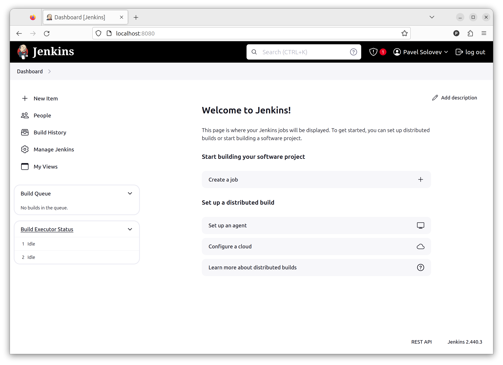

## Содержание

#### Основная часть
- [Установка](#установка-jenkins) 
- [Ключики](#ключики)
- [Первая джоба](#первая-джоба)
- [Запуск сборки по расписанию](#запуск-сборки-по-расписанию)
- [Параметризованная сборка](#параметризованная-сборка)

#### Дополнительно

- [Загрузка образа на docker hub](#загрузка-образа-на-docker-hub)
- [Запуск отдельных Jenkins агентов через Ansible](#запуск-отдельных-jenkins-агентов-через-ansible)

### Установка Jenkins

Впервые запустив виртуальную машину и добавив своего пользователя, выполняем ```sudo apt update``` и ```sudo apt upgrade```. \
После этого воспользуемся предоставленными инструкциями и поставим Jenkins.

Прокинутые туннели позволили получить доступ к свежеустановленному Jenkins.


### Ключики

Выписываем новый ключик для Jenkins и обязательно сохраняем его в надежном месте.


### Первая джоба

Создаем первую джобу с записанными кредами.


Первый билд прошел успешно. Самая простейшая джоба выполнена, необходимо разбираться дальше.


### Запуск сборки по расписанию

Следующей задачей стоит сделать запуск пайплайна по расписанию. Проставив галочку в ```Build Triggers``` в пункте ```Build periodically``` можно в формате cron указать периодичность запуска билда. Для тестирования выставим небольшие значения.


Такой подход к организации проверок, на мой взгляд, не выглядит самым разумным, особенно когда изменения в проект вносятся нерегулярно. Думаю, стоит разобраться с интеграцией вебхуков с гитлаба чтобы сборка выполнялся по требованию, а не по времени.

### Параметризованная сборка

Крайним пунктом в ДЗ стоит выполнение параметризованной сборки с указанием ветки, с которой эта сборка должна выполняться. \
Для выполнения поставленной задачи необходимо добавить параметр ```BRANCH```, который будет принимать название ветки для билда. Стандартным значением оставим ```main```. \
Для реализации передачи параметра можно воспользоваться ```String Parameter```, но я решил изучить имеющиеся плагины, и наткнулся на ```Git Parameter```. В дальнейшем использование этого плагина позволит удобно писать скриптовые пайплайны, завязанные на гите.


Данный плагин автоматически подтягивает ветки с GitLab и предлагает их на выбор при запуске пайплайна.


### Загрузка образа на Docker Hub

В freestyle project образ можно не только собирать, но и публиковать его на Docker Hub. Для этого был написан простенький скрипт, отправляющий только ```latest``` сборку, если это любая отличная от ```main``` ветка, либо еще и ```stable```, если все же билд производится с ```main``` ветки. 

В качестве пароля в ```Password Parameter``` был передан ```Access Token```. Однако, такой подход неидеален, так как в ```Console Output``` все еще можно увидеть этот токен. Вероятно, стоит рассмотреть другой способ логина на Docker Hub, как, например, запись в .json с помощью команды ```echo``` и последующее чтение кредов из него. 

```shell
buildah bud --tag currency_app:latest -f ./Dockerfile .
buildah push --creds $DOCKERHUB_USERNAME:$DOCKERHUB_PASSWORD \
 currency_app:latest \
 docker.io/$DOCKERHUB_USERNAME/currency_app:latest
if [ "${BRANCH}" = "origin/main" ]; then
buildah push --creds $DOCKERHUB_USERNAME:$DOCKERHUB_PASSWORD \
 currency_app:latest \
 docker.io/$DOCKERHUB_USERNAME/currency_app:stable
fi
```

### Запуск отдельных Jenkins агентов через Ansible

Выдано было 3 виртуальные машины, и я решил попробовать поднять агентов для Jenkins на них, и затем, соответственно, запустить билды на них. 
Поднять агентов вручную было несложно, поэтому из интереса решил копнуть чуть глубже. 

Был найден плагин swarm, с помощью которого стало возможно автоматизировать их развертку. Стандартный путь подразумевает авторизацию агента с помощью ключа, который возможно получить только из GUI Jenkins или распарсив xml из `jenkins-agent.jnlp`. Ни тот, ни другой путь адекватными не воспринялись ввиду желания качественно автоматизировать процесс развертки. 

С помощью `Swarm` же агенты подключаются по заранее переданным `username:password` или `username:token`. 

Итак, первым делом были написаны тесты для разрабатываемой роли (TDD круто же). Ох, и горя было получено ввиду использования в качестве подопытных докер образов, а не виртуальных машин. Частично протестировать роль удалось.

По итогу роль выглядит следующим образом:

```yaml
- name: Die if jenkins agent password is undefined
  ansible.builtin.fail:
    msg: "Parameter 'jenkins_agent_password' is  not defined."
  when:
    - "not jenkins_agent_password is defined"

- name: Ensure neccessary packages installed
  ansible.builtin.package:
    state: present
    name:
      - curl
      - openjdk-17-jdk-headless

- name: Make sure directories exist
  ansible.builtin.file:
    path: "{{ item.path }}"
    state: directory
    mode: "{{ item.mode }}"
    recurse: true
  loop:
    - path: /usr/local/jenkins-service
      mode: "0644"
    - path: /opt/jenkins
      mode: "0755"
    - path: "{{ jenkins_agent_home }}"
      mode: "0755"

- name: Download swarm client
  ansible.builtin.get_url:
    url: "{{ jenkins_agent_jenkins_url }}/swarm/swarm-client.jar"
    dest: /opt/jenkins/swarm-client.jar
    mode: "0755"

- name: Create group
  ansible.builtin.group:
    name: "{{ jenkins_agent_group }}"
    state: present

- name: Create user
  ansible.builtin.user:
    name: "{{ jenkins_agent_user }}"
    group: "{{ jenkins_agent_group }}"
    shell: /bin/sh
    home: "{{ jenkins_agent_home }}"
    state: present

- name: Change home dir owner
  ansible.builtin.file:
    path: "{{ jenkins_agent_home }}"
    state: directory
    mode: "0755"
    owner: "{{ jenkins_agent_user }}"
    group: "{{ jenkins_agent_group }}"
    recurse: true

- name: Create SH file
  ansible.builtin.template:
    dest: "{{ jenkins_agent_home }}/run_agent.sh"
    mode: "0755"
    src: run_agent.sh.j2

- name: Create service
  ansible.builtin.template:
    dest: /etc/systemd/system/jenkins-agent.service
    src: service.j2
    mode: "0644"

- name: Check if systemd is available
  ansible.builtin.stat:
    path: /bin/systemctl
  register: systemctl_check

- name: Enable Jenkins Agent service
  ansible.builtin.systemd:
    state: started
    enabled: true
    name: jenkins-agent
    daemon_reload: true
  when: systemctl_check.stat.exists

```

Поднятые агенты видны в GUI Jenkins и доступны к использованию.


Чтобы применить их к конкретной джобе необходимо в настройках указать `label`, присвоенный этим нодам. В данном случае они автоматически получили лейбл `swarm`.

